# ThinkNode M1 native e-ink UI (`ui-thinknode-m1` / "UnifontUI")

A companion-radio UI for the ThinkNode M1's **200×200 e-ink** display, driven by the
case's **two buttons** (triangle + circle). Every screen is a vertical list: scroll with
one button, act with the other. All text and icons render 1:1 at native resolution from a
built-in **GNU Unifont** subset (real Unicode, not a `█` fallback) — hence the build name.

## Screens

<table>
  <tr>
    <td align="center">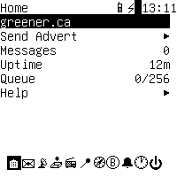<br><sub>Home</sub></td>
    <td align="center">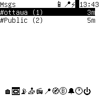<br><sub>Messages</sub></td>
    <td align="center">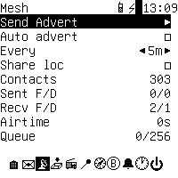<br><sub>Mesh</sub></td>
    <td align="center">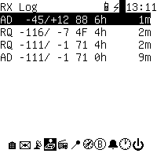<br><sub>RX Log</sub></td>
  </tr>
  <tr>
    <td align="center">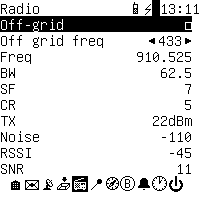<br><sub>Radio</sub></td>
    <td align="center">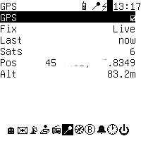<br><sub>GPS</sub></td>
    <td align="center">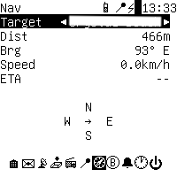<br><sub>Nav</sub></td>
    <td align="center">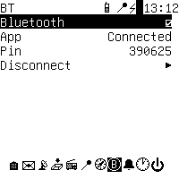<br><sub>Bluetooth</sub></td>
  </tr>
  <tr>
    <td align="center">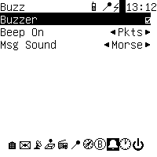<br><sub>Buzz</sub></td>
    <td align="center">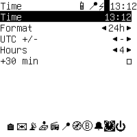<br><sub>Time</sub></td>
    <td align="center">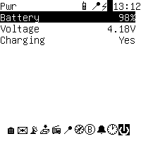<br><sub>Power</sub></td>
    <td></td>
  </tr>
</table>

## Building

Dev build / flash (nRF52 DFU over USB):

```sh
pio run -e ThinkNode_M1_companion_radio_ble_unifontui             # build
pio run -e ThinkNode_M1_companion_radio_ble_unifontui -t upload   # flash
```

Branded **release** binaries (named `…_ble_unifontui-<ver>.uf2` + DFU `.zip`, landing in `out/`):

```sh
FIRMWARE_VERSION=unifontui-dev ./build.sh build-firmware ThinkNode_M1_companion_radio_ble_unifontui
```

The `_unifontui` suffix (mishmesh-style branding) keeps this out of upstream's stock
`_companion_radio_ble` all-boards matrix, so build/release it explicitly. The old GxEPD
`ui-new` UI is **upstream's** `ThinkNode_M1_companion_radio_ble` env.

Key flags: `DISPLAY_CLASS=NativeEinkDisplay`, `USE_NATIVE_EINK_UI`, `KEEP_DISPLAY_ON_USB`
(panel stays lit on USB), `AUTO_OFF_MILLIS=15000` (frontlight timeout — the e-ink keeps its
image).

## Buttons

Two buttons named for the case symbols; two gestures only — **click** and **hold** (~0.5 s),
so a click acts on release (no double-click wait):

| Button       | Click             | Hold                    |
|--------------|-------------------|-------------------------|
| **Circle**   | next item (wraps) | select / open the item  |
| **Triangle** | next page (wraps) | previous page / back    |

Triangle-hold is a universal "back" (in Messages it pops read-view → list → conversations).
Any press while asleep just wakes the screen. Holding circle in the **first 8 s after boot**
enters CLI rescue (serial console — see Screenshots).

## Pages

A bottom **page-icon bar** (🏠 ✉ 📡 📥 📻 📍 🧭 Ⓑ 🔔 🕐 ⏻) shows the fixed order with the
current page reverse-video; tall pages get a glyph scrollbar (│ track, █ thumb).

1. **Home** — node name (**activate → QR of your key**: a `meshcore://contact/add?…` code
   another MeshCore user scans to add you), `Send Advert`, unread count, `Uptime`, `Queue`, `Help`.
2. **Messages** — the unread-by-app queue grouped into conversations (one row per channel and
   per direct contact, with count + last time); drill in for a word-wrapped read view.
3. **Mesh** — `Send Advert`; **`Auto advert`** on/off, **`Every`** interval (5m…12h), and
   **`Share loc`** (location in adverts); then `Contacts`, `Sent F/D`, `Recv F/D`, `Airtime`, `Queue`.
4. **RX Log** — live per-packet log (newest first) in fixed columns: 2-char type
   (`AD/MS/CH/AK/PA/TR/RQ/RS/AR/GD/CT/MP/RW`), `-rssi/+snr`, the **last hop** (the path-hash of
   the node you actually heard — the full `getPathHashSize()` bytes, right-justified and padded
   to 3 bytes so the hop column stays aligned). Only **flood** packets carry the transmitter
   (each relay appends its hash); a 0-hop flood shows the origin's key/channel byte. **Direct**-
   routed packets don't record the transmitter (their path is a forward route), so they show `--`,
   as do types with no identity. Then hop count (`2`) and right-aligned age.
5. **Radio** — `Off-grid` (client-repeat) toggle + read-only `Off grid freq` (433/869/918,
   band-locked to the node's operating band — the RF front-end is tuned for one band and
   can't be probed, so an off-band preset is never offered); read-only `Freq`/`BW`/`SF`/`CR`/`TX`
   (set via the app) + live `Noise`/`RSSI`/`SNR`.
6. **GPS** — read-only last-good-fix `Fix`/`Last`/`Sats`/`Pos`/`Alt` (the M1's physical switch
   controls the receiver; the 📍 status icon reflects it).
7. **Nav** — `Target` (cycles located favourite contacts), `Dist`, `Brg`, `Speed`, `ETA`, plus a
   glyph compass: **heading-up while moving** (rose rotates to GPS course; centre arrow points the
   way to turn), **north-up when stopped** (the M1 has no magnetometer). `?`/`--` without a fix or
   waypoint.
8. **Bluetooth** — `Bluetooth` toggle, `App` (connected?), `Pin`.
9. **Buzz** — `Buzzer` master toggle; `Beep On` **Msgs** (CTU/Beep/Morse) *or* **Pkts** (per-type
   chirps on every decoded packet) — mutually exclusive.
10. **Time** — clock `Format` (12/24h) + `UTC` offset.
11. **Power** — `Battery` %, `Voltage`, `Charging` (info only).

A boot **Splash** (logo + version + build date) shows ~3 s first.

## Display behaviour

- **Native 200×200**, no upscaling; real Unicode/symbols from the Unifont subset.
- **Refresh:** while the screen is awake (always on USB power; the on-window on battery) the UI
  polls ~500 ms so content changes (new packet, message, stat) appear promptly. A per-frame **CRC**
  skips the physical e-ink refresh when nothing changed — so no flicker: only genuine changes and
  the once-a-minute time tick redraw. Battery reads are cached (5 s) so ADC noise doesn't churn the
  display. Static overlays (Help, QR) hold a long cadence.
- **Sleep (battery):** after 15 s idle the frontlight turns off; the e-ink keeps its image and
  re-draws once a minute, with a black/white swing to clear partial-update ghosting.
- **CLI rescue** shows a 🔧 in the status bar (the companion/BLE link is suspended); reboot to exit.

## Screenshots (CLI rescue)

Enter CLI rescue (circle-hold within 8 s of boot), then over the USB serial console:

- `screenshot` — a **sixel** image inline (iTerm2 / WezTerm / foot).
- `screenshot pbm` — an ASCII **PBM**; capture to a file and convert with stock `sips`, e.g.
  `… > shot.pbm && sips -s format png shot.pbm --out shot.png`.

Both render from a 1-bit shadow framebuffer that `NativeEinkDisplay` mirrors from every draw op
(GxEPD2's own buffer is private).

## Implementation

Shares the `UITask` / `AbstractUITask` surface, so `main.cpp` and `MyMesh` need zero changes and
the whole UI lives in this directory — swapped in via the per-board `-I …/ui-thinknode-m1` include
path + `*.cpp` glob. No heap, no `std::function`: elements are plain structs with C function
pointers + a `void* ctx`.

| File                        | Responsibility |
|-----------------------------|----------------|
| `UIElements.{h,cpp}`        | `UIElement` struct, `ElemKind`, `make*` factories, per-element draw. |
| `ElementScreen.{h,cpp}`     | Scrollable list base: status bar, page-icon bar, scrollbar, focus/scroll, input routing. |
| `Pages.{h,cpp}`             | Concrete screens + element getters/callbacks. |
| `UITask.{h,cpp}`            | `AbstractUITask` impl: pages, button dispatch, refresh timing, LED/buzzer, message intake, shutdown. |
| `NativeEinkDisplay.{h,cpp}` | 1:1 200×200 GxEPD2 driver, CRC dirty-check, shadow buffer + sixel/PBM dump, UTF-8 Unifont blitter. |
| `unifont_glyphs.h`          | Generated packed GNU Unifont subset (sorted codepoint index + 1-bit glyphs); see `tools/gen_unifont.py`. |
| `icons.h`                   | XBM bitmaps (logo, status-bar glyphs). |

Buttons: triangle = `user_btn`/GPIO42; circle = `back_btn`/GPIO39 (active-low + internal pull-up).

### Text rendering (GNU Unifont)

`tools/gen_unifont.py` filters the Unifont `.hex` files to a chosen set of codepoint ranges into
`unifont_glyphs.h` (a sorted, binary-searchable index + a 1-bit glyph blob); a UTF-8-aware blitter
does per-codepoint lookup at native resolution. The curated subset is Latin + punctuation / symbols
/ arrows + a set of emoji (CJK/Hangul omitted — the full BMP would be ~1.5–2 MB). Emoji (Plane 1,
4-byte UTF-8) are monochrome 16×16 line-art.
